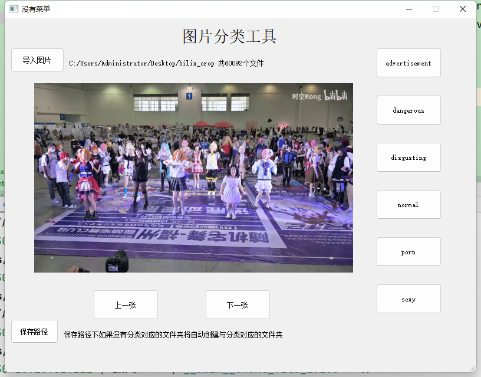

#### 图片分类工具

使用介绍

1、修改`config.py`文件中的分类，有中文和英文两种字典（使用`use_chines`参数控制），界面上分类类型和保存路径均使用

2、首先导入图片，选择需要分类的文件夹

3、选择保存路径，选择分类后保存的位置，如果位置下不存在每个分类文件夹，则进行创建，文件夹名称和config里面字典值一致

4、下一张则表示该图片不分类

5、右侧选择所属分类，选择后将图片`move`移动到对应的路径下
